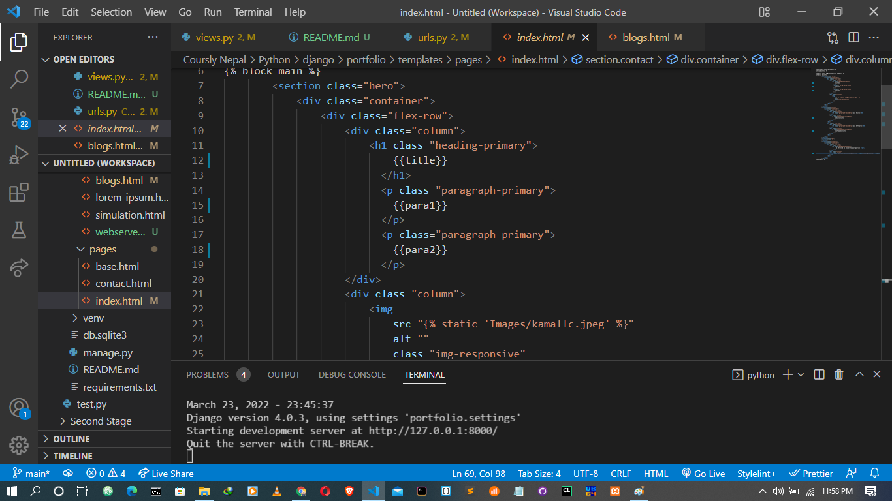
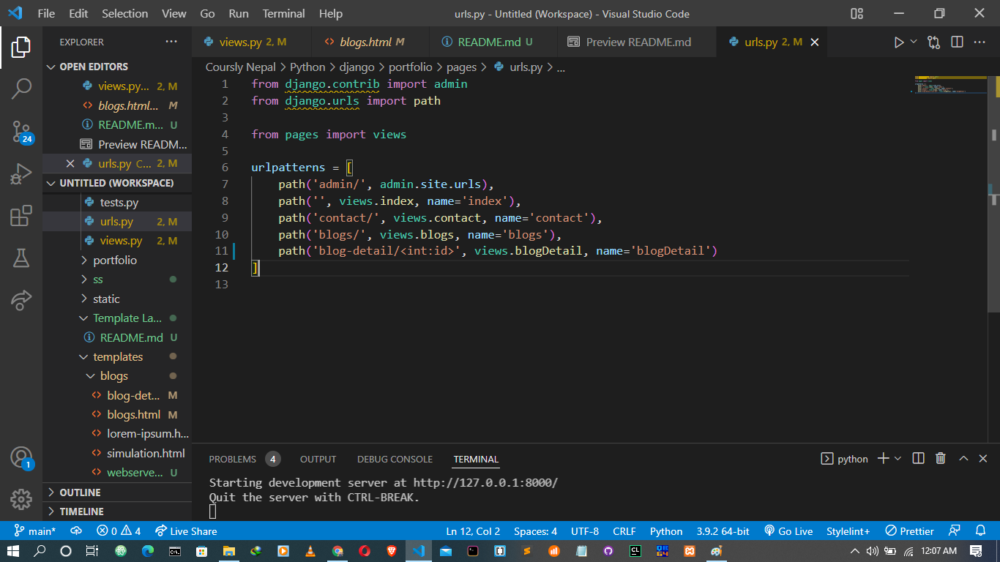
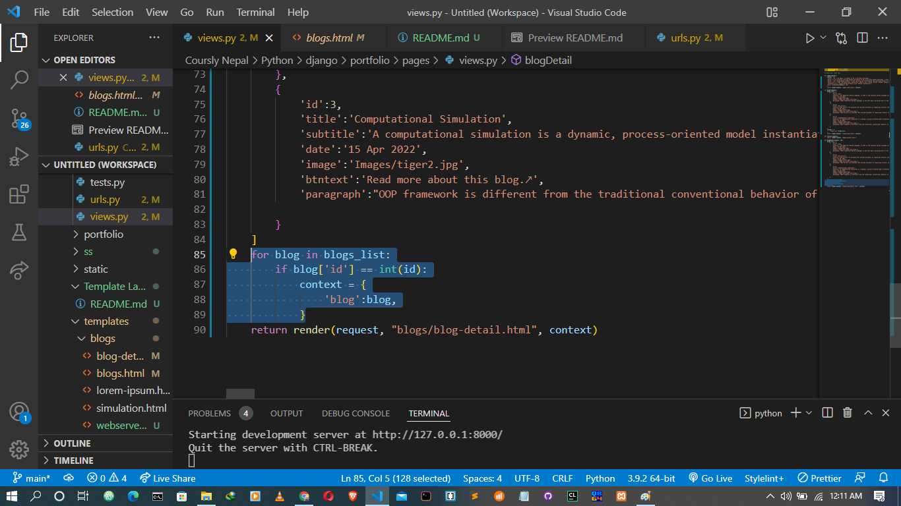

# sending data to the html file

# using backend data as content

# using for loop to display multiple blog post

# changing url (adding id in url)

# getting id from click and sending to the blogDetail function of view

# choosing right blog detail according to id

# displaying blog detail
